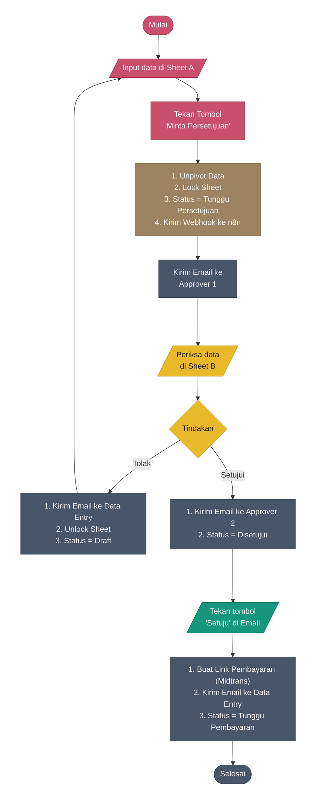

# Proses Input Data → Approval

```mermaid
flowchart TB
    subgraph Row1[" "]
        direction LR
        Mulai(["Mulai"])
        InputA[/"Input data di Sheet A"/]
        TekanMinta["Tekan Tombol<br>'Minta Persetujuan'"]
        Unpivot["1. Unpivot Data<br>2. Lock Sheet<br>3. Status = Tunggu Persetujuan<br>4. Kirim Webhook ke n8n"]
        EmailApprover1["Kirim Email ke<br>Approver 1"]

        Mulai --> InputA --> TekanMinta --> Unpivot --> EmailApprover1
    end

    subgraph Row2[" "]
        direction RL
        PeriksaB[/"Periksa data<br>di Sheet B"/]
        Tindakan{"Tindakan"}
        Tolak["1. Kirim Email ke Data Entry<br>2. Unlock Sheet<br>3. Status = Draft"]
        Setujui["1. Kirim Email ke Approver 2<br>2. Status = Disetujui"]

        PeriksaB --> Tindakan
        Tindakan -- Tolak --> Tolak
        Tindakan -- Setujui --> Setujui
    end

    subgraph Row3[" "]
        direction LR
        TekanSetuju[/"Tekan tombol<br>'Setuju' di Email"/]
        BuatLink["1. Buat Link Pembayaran (Midtrans)<br>2. Kirim Email ke Data Entry<br>3. Status = Tunggu Pembayaran"]
        Selesai(["Selesai"])

        TekanSetuju --> BuatLink --> Selesai
    end

    EmailApprover1 --> PeriksaB
    Tolak --> InputA
    Setujui --> TekanSetuju

    classDef maker fill:#c94f6d,color:#ffffff,stroke:#a3395a,stroke-width:1px;
    classDef checker fill:#eab929,color:#1a1a1a,stroke:#c49b1e,stroke-width:1px;
    classDef releaser fill:#16967d,color:#ffffff,stroke:#0f7a66,stroke-width:1px;
    classDef appscript fill:#9c8462,color:#ffffff,stroke:#7d6a4e,stroke-width:1px;
    classDef n8n fill:#48566a,color:#ffffff,stroke:#374252,stroke-width:1px;

    class Mulai,InputA,TekanMinta maker
    class PeriksaB,Tindakan checker
    class TekanSetuju releaser
    class Unpivot appscript
    class EmailApprover1,Tolak,Setujui,BuatLink,Selesai n8n

    style Row1 fill:none,stroke:none
    style Row2 fill:none,stroke:none
    style Row3 fill:none,stroke:none
```
